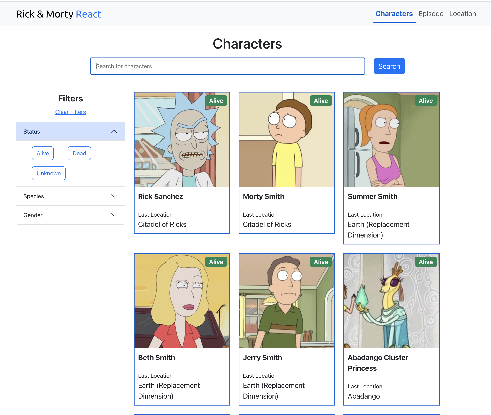

# Rick & Morty React Mini Project

React application that pulls data from https://rickandmortyapi.com


## Screenshots




## Tech Stack

**Client:** React, SASS, Bootstrap

**Server:** Node


## Run Locally

Clone the project

```bash
  git clone https://github.com/twistedstack/react-rick-morty.git
```

Go to the project directory

```bash
  cd react-rick-morty
```

Install dependencies

```bash
  npm install
```

Start the server

```bash
  npm run start
```


## Badges


[](https://choosealicense.com/licenses/mit/)


